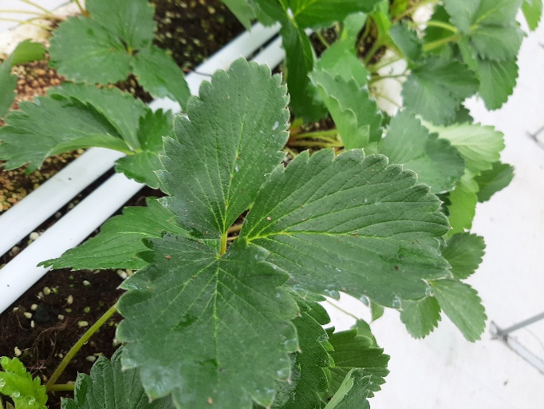
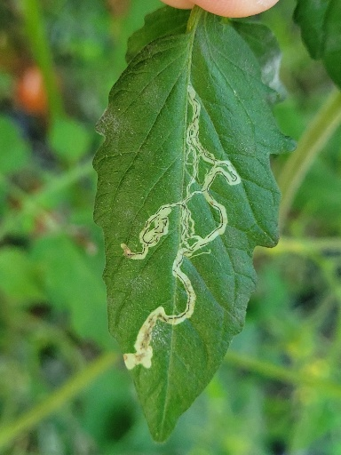
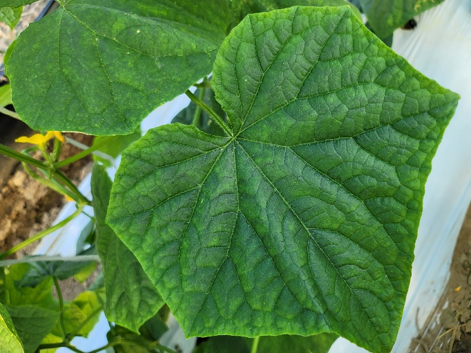
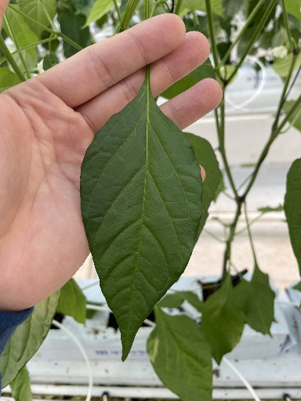

# Anomaly Detection
<!-- BVMS anomaly detection with AE and/or VAE  
Clearning up the code   -->

## Introduction
This code originally was written for **turbine diagnosis.**   
For diagnosis, our team used feature image that extracted from blade vibration signal was used as training and test data.  
But, unfortunately the detail explanation and dataset release are trade secret. **therefore, this code is operated by replacing the dataset with open dataset.**

The code related to turbine diagnosis is preserved on *BVMS branch*, *master branch* is related to open dataset.

## Open dataset
It is an image dataset provided by AI challenge website called DACON. First, this is consisted of 6 types of crop images.  
* Strawberry, Tomato, Paprika, Cucumber, Pepper, Grapes.  
    
    
    
    
    
    
    (listed in order)  

Second, 12 types of crop status and 4 types of degree of disease damage are consisted.

## Requirements
The code on *BVMS branch* was tested with Tensorflow 1.12.0, CUDA 8.0 and Ubuntu 18.04

*Cleaning up the code*